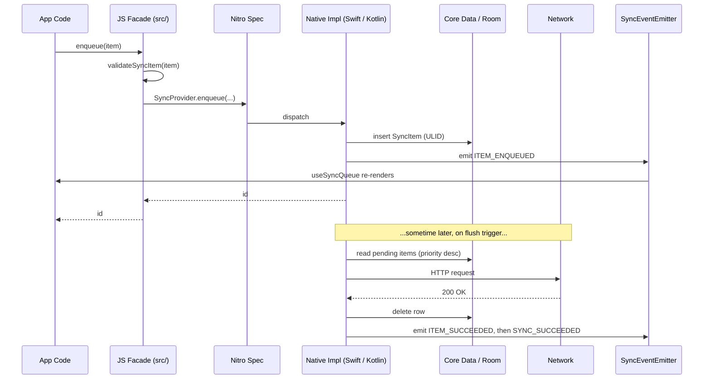
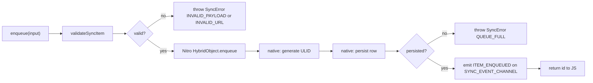
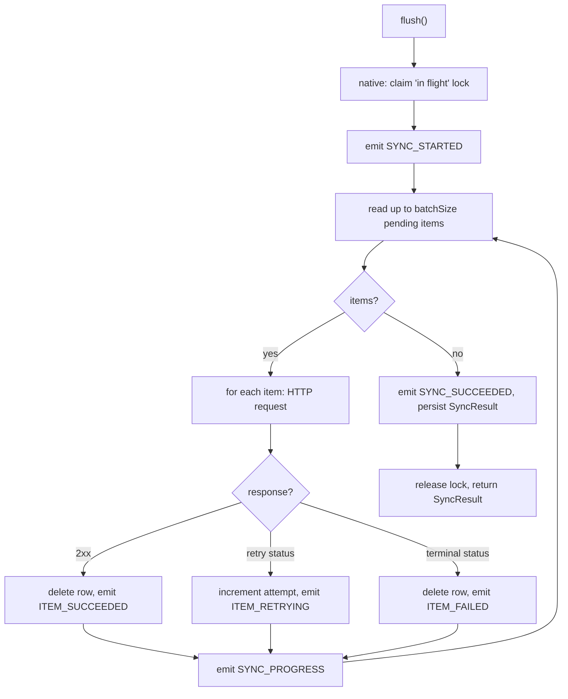
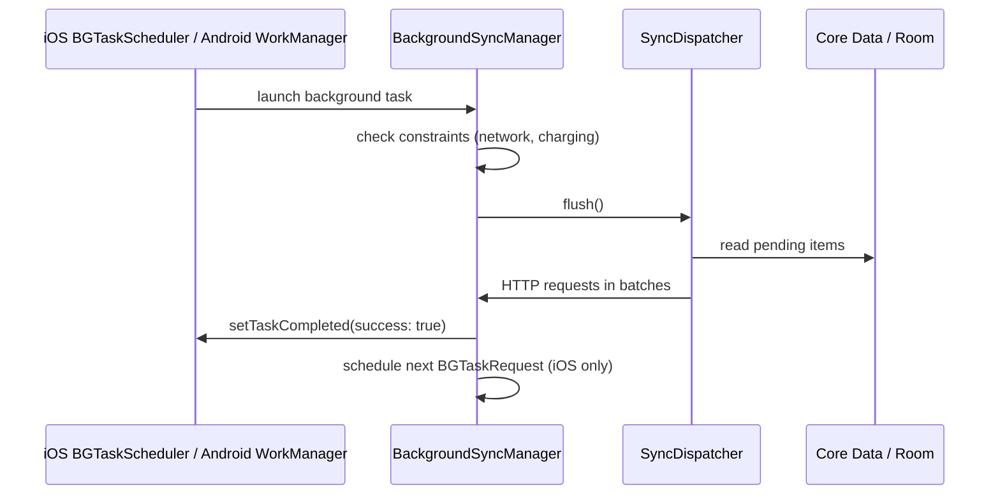
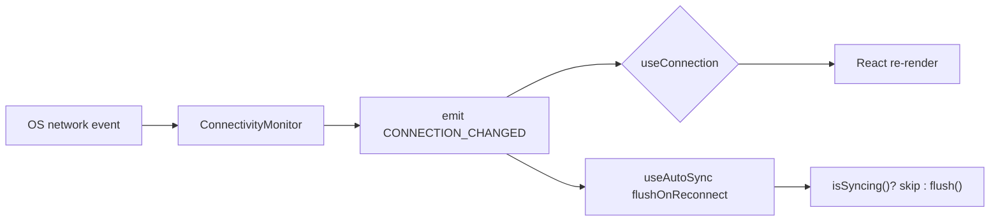
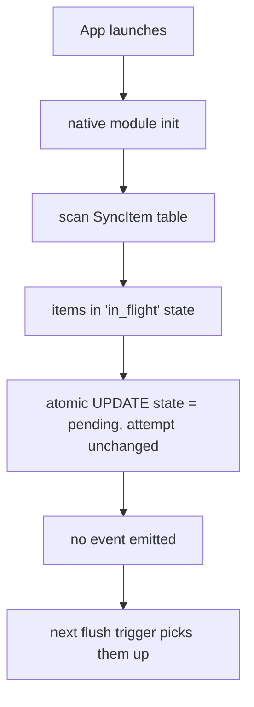

# Data Flow

Every major operation in `react-native-sync-provider` follows a predictable path through the three layers. This page traces the flows you'll need when debugging, building integrations, or contributing.

## High-Level Flow

## Enqueue Flow

Steps:

1. **Validate (JS)**. `validateSyncItem` ensures `method` is in [`HttpMethod`](../api-reference/enums.md#httpmethod) and `url` parses. Failures throw `SyncError` synchronously inside the awaited call.
2. **Cross JSI**. Nitro dispatches the `enqueue` call. The item object is passed through as a typed JS object -- no JSON marshalling.
3. **Generate ULID (native)**. The native `Ulid` / `ULID` utility produces a 26-character monotonic id.
4. **Persist (native)**. The item is inserted into Core Data (iOS) or Room (Android) inside a transaction. If the queue is at `maxQueueSize`, the insert fails and the dispatcher throws `QUEUE_FULL`.
5. **Emit (native)**. `SyncEventEmitter` fires `ITEM_ENQUEUED` with the id and metadata.
6. **Resolve (JS)**. The promise resolves to the id.

`enqueueBatch` follows the same flow but inside a single native transaction, so the entire batch is atomic.

## Foreground Flush Flow

Notes:

- The flush is **single-flight** per process. Concurrent `flush()` calls reuse the same in-flight run; the second `Promise` resolves with the same `SyncResult`.
- HTTP requests run on the native dispatcher's executor (`URLSession` on iOS, OkHttp + `Dispatchers.IO` on Android). The JS thread is never blocked.
- The `SyncResult` is persisted to history before the promise resolves.

## Background Flush Flow

Per-platform specifics:

- **iOS**. `BGTaskScheduler` wakes a registered handler. The handler must complete (or call `setTaskCompleted(success:)`) before the OS-imposed deadline (typically 30s for `BGAppRefreshTaskRequest`, longer for `BGProcessingTaskRequest`). After completion, the handler reschedules itself.
- **Android**. WorkManager's `CoroutineWorker` is dispatched at most every 15 minutes (the platform floor). The worker calls `flush()` and returns `Result.success()` / `Result.retry()`. WorkManager handles re-attempt scheduling.

## Connectivity Change Flow

The native monitor is a singleton per process. It debounces transient flaps (a brief loss + restore) and emits at most one event per real transition.

## Recovery Flow (App Launch)

Recovery handles the "process killed mid-dispatch" case. Without it, items would be stuck `in_flight` forever. The reset is **transactional and idempotent** -- safe to run on every launch.

## See also

- [Architecture overview](./overview.md).
- [iOS native architecture](./ios-native.md), [Android native architecture](./android-native.md).
- [Background sync guide](../guides/background-sync.md), [Connectivity detection guide](../guides/connectivity-detection.md).
