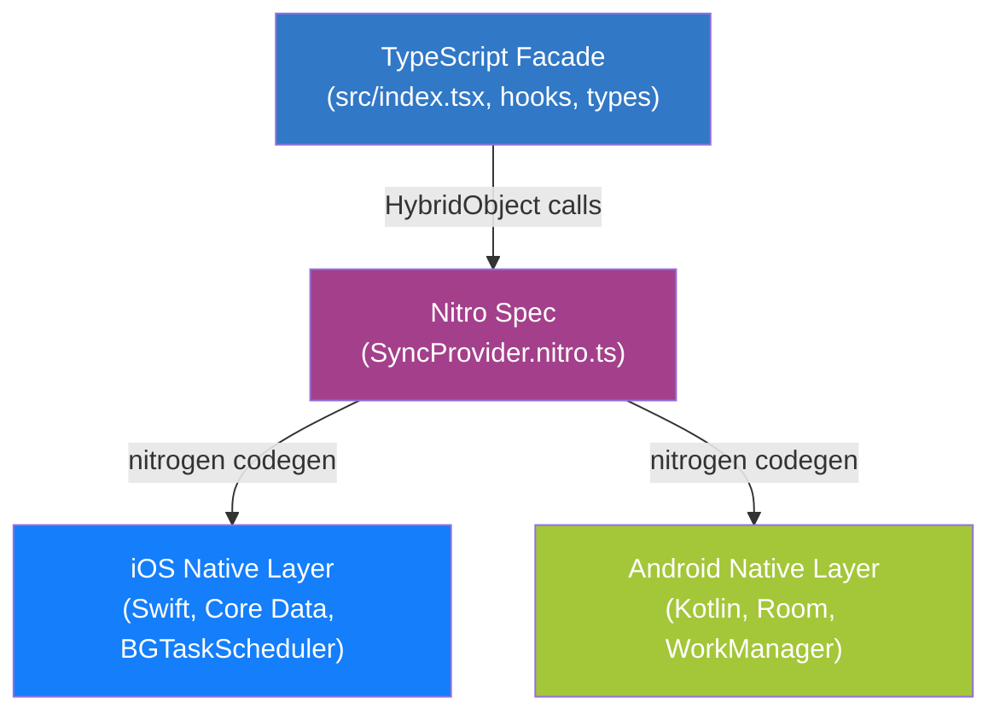

# Architecture Overview

`@gabriel-sisjr/react-native-sync-provider` is built on three layers that cooperate through a generated JSI bridge. The TypeScript facade is the only surface app code touches; the native layers do the heavy lifting (persistence, dispatch, scheduling).

## Three-Layer Design

### Layer 1: TypeScript Facade

Source of every public symbol: 19 functions, 8 hooks, the `SyncProvider` context, every type and enum, the `SyncError` class. Located under `src/`. Responsibilities:

- Validate inputs (`validateSyncItem`).
- Translate the native sentinel `startedAt === 0 && finishedAt === 0` for `getLastSyncResult` into `undefined`.
- Wrap raw native errors in [`SyncError`](../api-reference/errors.md) with a typed [`SyncErrorCode`](../api-reference/errors.md#syncerrorcode).
- Provide React hooks that subscribe to native events and re-render on relevant transitions.
- Degrade gracefully on web / SSR via `src/index.web.tsx` and `isNativeModuleAvailable`.

### Layer 2: Nitro Spec

`src/SyncProvider.nitro.ts` declares a `HybridObject<{ ios: 'swift'; android: 'kotlin' }>` interface. This is the source of truth for the JS↔native contract. Running `yarn nitrogen` produces:

- A C++ spec header per platform (`HybridSyncProviderSpec`).
- iOS autolinking ruby (`SyncProvider+autolinking.rb`) included by the podspec.
- Android autolinking gradle + cmake fragments included by `android/build.gradle` and `android/CMakeLists.txt`.
- The JNI loader stub (`syncproviderOnLoad.hpp`).

Generated artifacts live under `nitrogen/` and are not committed.

### Layer 3: Native Implementations

Each platform implements the spec using platform-idiomatic patterns:

| Concern | iOS | Android |
|---------|-----|---------|
| Language | Swift 5.9+ | Kotlin 2.0.21 |
| Persistence | Core Data (SQLite) | Room (KSP, SQLite) |
| HTTP dispatch | `URLSession` + `URLSessionConfiguration.background` | OkHttp 4.12.0 + Coroutines 1.8.1 |
| Connectivity | `NWPathMonitor` (Network framework) | `ConnectivityManager.NetworkCallback` |
| Background scheduler | `BGTaskScheduler` (`BGAppRefreshTaskRequest` + `BGProcessingTaskRequest`) | WorkManager 2.9.1 (`PeriodicWorkRequest` + `OneTimeWorkRequest`) |
| Boot recovery | `BackgroundURLSessionDelegate` + `RecoveryManager` | `BootCompletedReceiver` + `RecoveryWorker` |
| Event emission | `SyncEventEmitter` -> Nitro callback | `SyncEventEmitter` -> Nitro callback |

## Why Nitro and Not TurboModule

Nitro Modules cross the JSI boundary as **typed JS objects** -- no JSON `parse` / `stringify` step, no enum-to-string mapping. For a sync queue that may shuttle hundreds of items between JS and native every second, that matters:

- Object payloads (`SyncItem`, `SyncEvent`) are dispatched as native objects, not JSON.
- Enum values are passed through as-is.
- Async functions return `Promise`s without bridge serialization.
- The library lives entirely on the New Architecture (Fabric + TurboModules + JSI).

The trade-off: Nitro requires the New Architecture to be enabled in the host app. The library does not provide a legacy bridge fallback.

## Key Data Structures

The native layer is built around three immutable record types:

| Type | Owner | Purpose |
|------|-------|---------|
| [`SyncItem`](../api-reference/types.md#syncitem) | Queue storage | The persisted row: id, method, url, headers, body, priority, createdAt, metadata. |
| [`SyncResult`](../api-reference/types.md#syncresult) | History storage | A completed flush: per-item success / failure breakdown, error map, timing. |
| [`SyncEvent`](../api-reference/types.md#syncevent) | Event emitter | A single broadcast on the [`SYNC_EVENT_CHANNEL`](../api-reference/listeners.md). |

These shapes are identical on both platforms -- the spec defines them once and both Swift and Kotlin implementations marshal to / from the same JS shape.

## Cross-Cutting Concerns

### Event System

Both platforms emit on the same channel string (`'sync-event'`) with the same payload shape. The 15 [`SyncEventType`](../api-reference/enums.md#synceventtype) values are the canonical set. Hooks like `useSyncQueue`, `useSyncStatus`, and `useConnection` are thin subscribers around this stream.

### Persistence and Recovery

Both platforms persist:

- The pending queue (Core Data `SyncItem` entity / Room `SyncItemEntity`).
- The sync history (Core Data `SyncResult` entity / Room `SyncResultEntity`).
- The current configuration (last applied `SyncOptions`).

On launch, the recovery layer scans for items left in an `in_flight` state by a previous run (process killed mid-dispatch) and atomically resets them to `pending`. Combined with the ULID `id`, replay is safe as long as the server treats the id as an idempotency key.

### Connectivity Monitoring

A single native monitor per process (`ConnectivityMonitor`) emits `CONNECTION_CHANGED` events. The dispatcher consumes these to gate flushes; the JS layer consumes them via `useConnection`.

## Next Steps

- [Data flow](./data-flow.md) -- step-by-step traces of every major operation.
- [iOS native architecture](./ios-native.md) -- Swift modules, Core Data stack, BGTaskScheduler wiring.
- [Android native architecture](./android-native.md) -- Kotlin modules, Room schema, WorkManager wiring.
